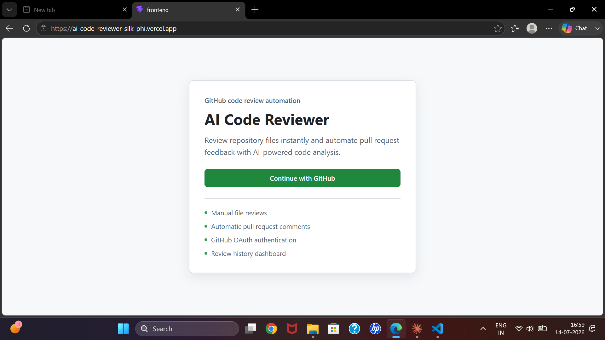
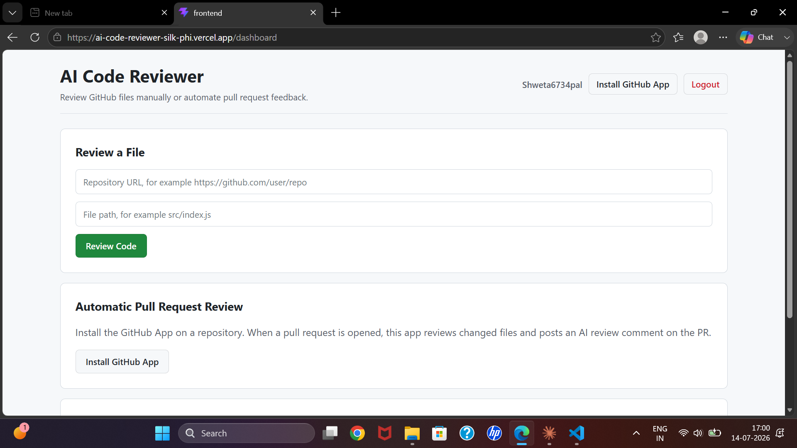
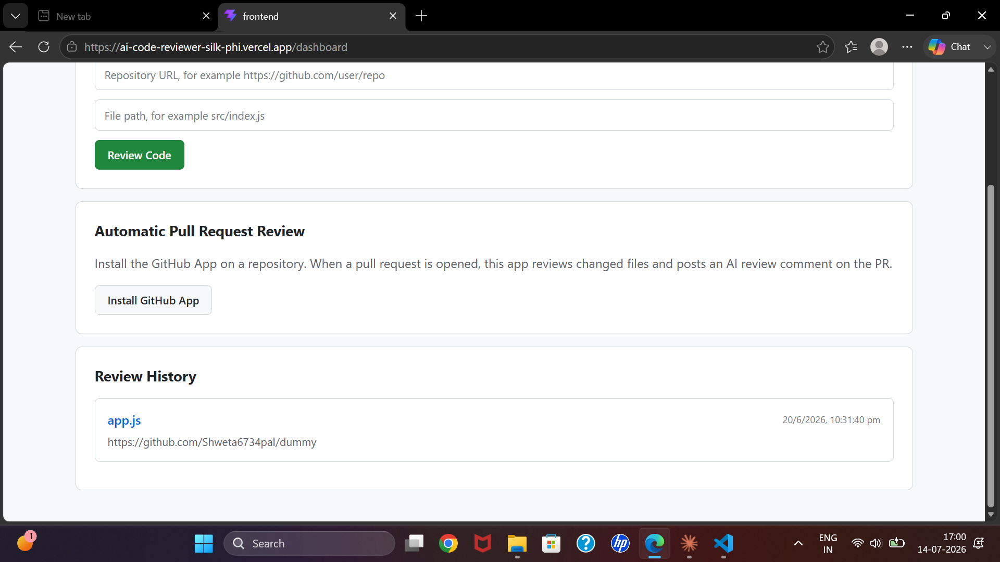
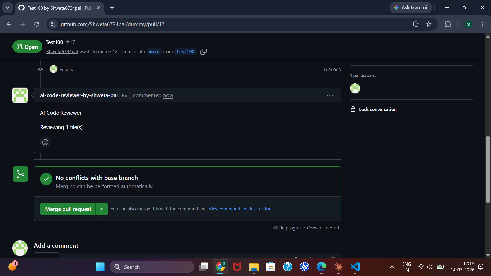
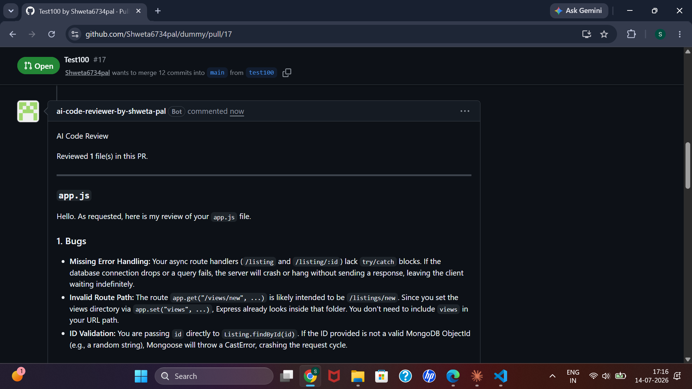
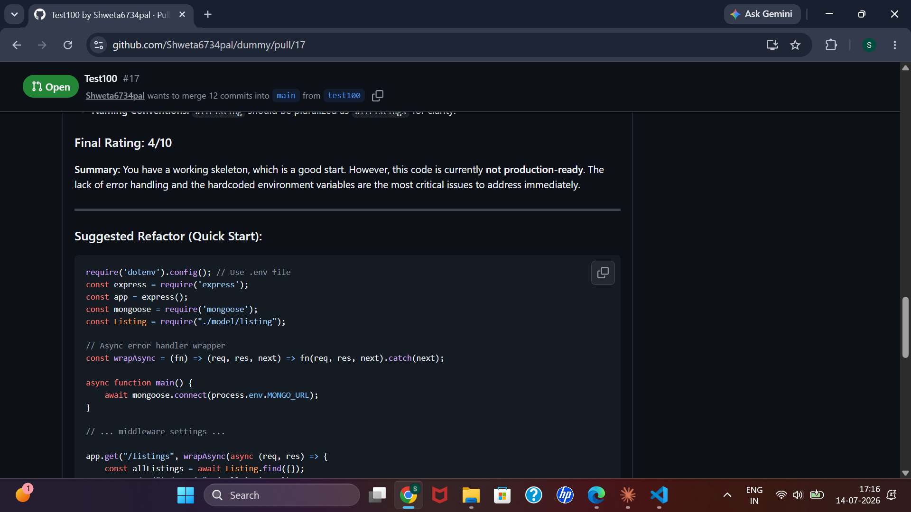

# AI Code Reviewer

An AI-powered code review tool that reviews GitHub code using Google's Gemini API — either on demand for a single file, or automatically on every pull request via a GitHub App.

- **Live app:** https://ai-code-reviewer-silk-phi.vercel.app
- **Backend API:** deployed on Render

---

## Screenshots

**Landing page**


**Dashboard**


**Review history**


**Automated PR review comment**

The bot posts a structured review directly on the pull request — bugs, performance issues, security problems, clean code suggestions, a rating out of 10, and even a quick-start refactor snippet.





---

## Features

- **GitHub OAuth login** — sign in with your GitHub account, session handled via JWT
- **Instant manual review** — paste a public GitHub repo URL + file path, get an AI review in seconds
- **Automated PR reviews** — install the GitHub App on a repo and every opened pull request gets reviewed automatically, with results posted as a PR comment
- **Review history** — past reviews are saved per user and viewable in the dashboard
- **Idempotent webhooks** — duplicate GitHub webhook deliveries (retries, multiple subscriptions) are detected and ignored using the `X-GitHub-Delivery` header
- **Rate limiting** — global and per-route limits to protect the API and Gemini usage

---

## Tech Stack

**Frontend**
- React 19 + Vite
- React Router
- react-markdown + remark-gfm (renders AI review output)

**Backend**
- Node.js + Express 5
- PostgreSQL + Prisma ORM
- JWT authentication
- GitHub OAuth App (user login) + GitHub App (installation-based PR automation)
- Google Gemini API (`@google/generative-ai`)
- express-rate-limit
- Jest + Supertest (tests)

**Deployment**
- Frontend → Vercel
- Backend → Render

---

## Project Structure

```
.
├── backend/
│   ├── config/
│   │   ├── prisma.js          # Prisma client instance
│   │   └── githubApp.js       # GitHub App JWT + installation token handling
│   ├── middleware/
│   │   └── authmiddleware.js  # Verifies JWT on protected routes
│   ├── routes/
│   │   ├── auth.js            # GitHub OAuth login + callback
│   │   ├── review.js          # Manual review + review history
│   │   └── webhook.js         # GitHub App webhook (PR review automation)
│   ├── utils/
│   │   └── geminiReview.js    # Builds the review prompt and calls Gemini
│   ├── prisma/
│   │   └── schema.prisma      # User, Review, WebhookDelivery models
│   ├── tests/
│   │   └── app.test.js
│   ├── server.js               # Express app (middleware + routes)
│   └── index.js                 # Entry point (loads env, starts server)
│
└── frontend/
    ├── src/
    │   ├── App.jsx             # Landing page + routing + token capture
    │   ├── Dashboard.jsx       # Logged-in view: run reviews, see history
    │   └── ...
    └── vite.config.js
```

---

## How It Works

### 1. Login
The user clicks **Login with GitHub**, which redirects to GitHub's OAuth authorize URL. On callback, the backend exchanges the code for an access token, fetches the GitHub profile, creates/finds a `User` row, and signs a JWT — which is passed back to the frontend as a query param and stored in `localStorage`.

### 2. Manual review
From the dashboard, the user submits a public GitHub repo URL and file path. The backend fetches the raw file content (trying `main`, falling back to `master`), sends it to Gemini with a structured review prompt (bugs, performance, security, clean code, rating out of 10), saves the result to the `Review` table, and returns it to the frontend.

### 3. Automated PR review
Once the GitHub App is installed on a repo, opening a pull request triggers a webhook to `/webhook/github`. The backend:
1. Verifies the payload signature (`X-Hub-Signature-256`) using HMAC-SHA256
2. Checks `X-GitHub-Delivery` against the `WebhookDelivery` table to skip duplicate deliveries
3. Fetches the changed files in the PR using an installation access token
4. Filters to reviewable source file extensions
5. Runs each file through Gemini
6. Posts a single consolidated review as a comment on the PR

---

## Getting Started

### Prerequisites
- Node.js 18+
- PostgreSQL database
- A GitHub OAuth App (for login)
- A GitHub App (for automated PR reviews) with a private key, installed on the repo(s) you want reviewed
- A Gemini API key

### Backend setup

```bash
cd backend
npm install
```

Create a `.env` file with:

```
PORT=5000
DATABASE_URL=
JWT_SECRET=
FRONTEND_URL=

GITHUB_CLIENT_ID=
GITHUB_CLIENT_SECRET=
GITHUB_CALLBACK_URL=

GITHUB_APP_ID=
GITHUB_APP_INSTALLATION_ID=
GITHUB_APP_PRIVATE_KEY_PATH=
GITHUB_WEBHOOK_SECRET=

GEMINI_API_KEY=
GEMINI_MODEL=gemini-2.0-flash
```

Run migrations and start the server:

```bash
npx prisma migrate deploy
npm run dev      # nodemon, for local development
npm start         # production
```

### Frontend setup

```bash
cd frontend
npm install
```

Create a `.env` file with:

```
VITE_API_URL=http://localhost:5000
```

```bash
npm run dev
```

### Running tests

```bash
cd backend
npm test
```

---

## Deployment Notes

- The Express backend needs to stay on a long-running server (not serverless) because webhook processing continues **after** the initial `200` response is sent — Render works well for this.
- On the frontend host, set `VITE_API_URL` to the deployed backend URL.
- On the backend host, set `FRONTEND_URL` to the deployed frontend URL **including the `https://` scheme** — a missing scheme will break CORS.
- The GitHub OAuth App's callback URL and the `GITHUB_CALLBACK_URL` env var must match exactly and point at the deployed backend, not a local tunnel.

---

## License

ISC
